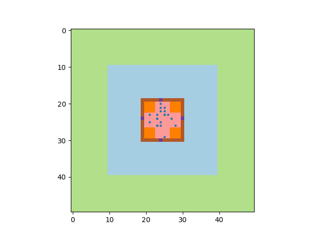

# CA4024 - Continuous Assessment 2

## Agent Based Model - Evacuation behaviour from a building under panic

This repository contains code which has been made to simulate evacuation behaviour of individuals from a building under panic.
The code makes use of the agent based simulator, [PyCX](https://github.com/hsayama/PyCX), as a basis for the model.

#### Environment
The environment of the model is a rectangular building, where the following parameters can be adjusted:
1. Building height and width
2. Number of stairwells in building
3. Size of stairwells
4. Number of exits in building
5. Size of doorways
6. Number of storeys in building
7. Distance to safezone

The building itself is situated at the centre of the environment, enclosed by a brown line representing the edges of the building.  
The exits are contained in the walls of the building as purple sections of the wall.  
The stairwells are in the corners of the building and are represented as orange squares.  
The green area of the environment is the safezone, where agents gather after evacuating from the building.  

#### Agents
In the case of this model, humans are represented as agents who are shown as blue circles.  
While in the building, agents use Moore neighbourhoods with assigned boundary conditions as the transition rule.  
Agents move towards exits and stairwells if they fall within their neighbourhood.  
Agents cannot leave the building without being on the ground floor and leaving through an exit.  

### Using the model

To run the model:

> git clone  
> cd ca4024-continuous-assessment-2  
> python3 abm-building-panic.py  

#### GUI

This will open two windows, similar to the example models provided by PyCX. One window acts as a control panel for the model, and another shows the simulation as it is running. It may be necessary for the user to expand these windows to see all controls and visualisations clearly.    

Simulations can be run using default parameters using the 'Run' button. The simulation will run until the 'Pause' button is selected.   Alternatively, one step can be taken at a time by using the 'Step Once' button. The 'Reset' button can be used to reset the model back to Step 0.  

If the user selects the 'Settings' tab, step size for the model can be adjusted. If step size is set to 2, 2 time steps will be taken for each iteration.  

If the user selects the 'Parameters' tab, values can be adjusted to change the environment. If the user holds their cursor over the text boxes, they can read a description of what adjusting the parameter does.  

The user can then select the 'Save parameters to the model and reset the model' option to save the adjusted parameters.  

### Rules & Reasons

Agents will be initialised on a random floor of the building.  
Agents move randomly within the bounds of the building. Agents cannot move into/through walls.  

<b> Agents on the ground floor </b> will move randomly, avoiding stairwells but looking for exits. When an exit is encountered within their Moore neighbourhood, Agents will move towards the door and then onto the safe zone.  

<b> Agents on a higher floor </b> will move randomly, looking for stairwells. When an agent moves into a stairwell, they will be re initialised on a lower floor and will have to continue looking for stairwells until they are on the ground floor.  

By moving randomly within the building, Agent behaviour simulates that of humans within a building with low visibility, such as a burning building with lots of smoke.  
